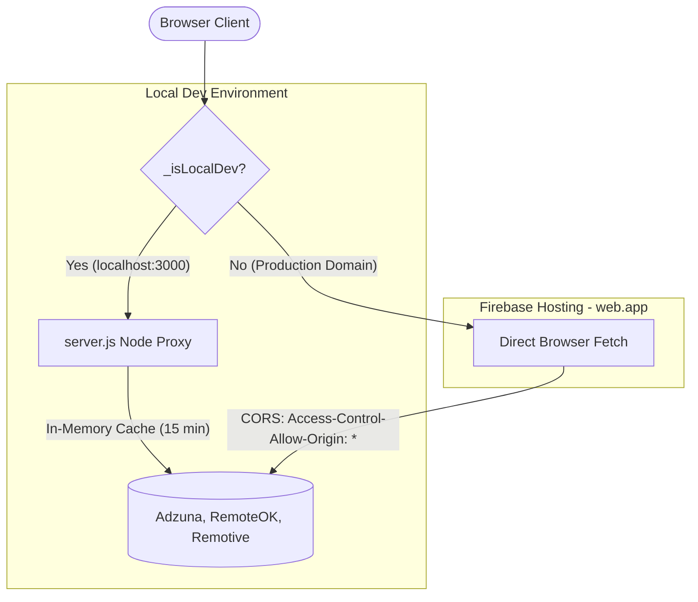
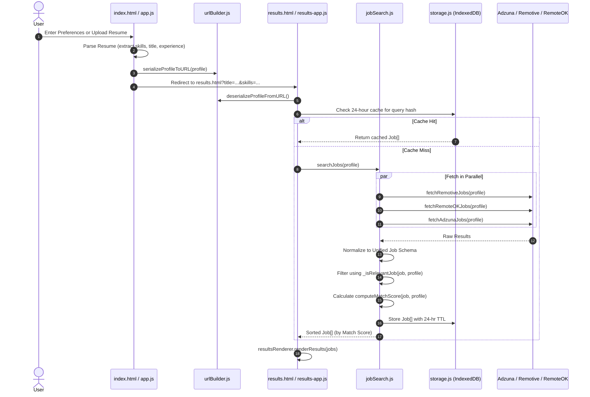
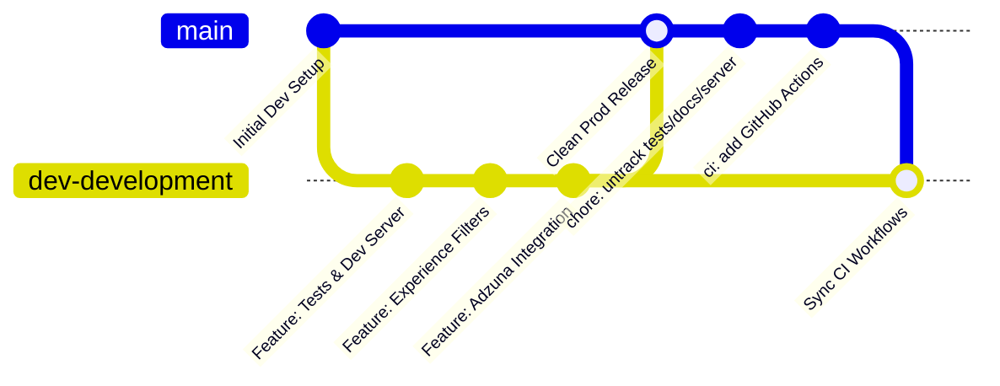

# FindMeAJob — Comprehensive Developer Guide 📘
> **Last Updated:** September 2026  
> **Target Audience:** Core Contributors, Maintainers, and Frontend Engineers  
> **Repository:** `https://github.com/Sanjuthecoder/FindMeAJob`

---

## Table of Contents
1. [Executive Overview & Philosophy](#1-executive-overview--philosophy)
2. [Dual-Mode Architecture (Dev vs. Prod)](#2-dual-mode-architecture-dev-vs-prod)
3. [Project Directory & File-by-File Manifest](#3-project-directory--file-by-file-manifest)
4. [End-to-End Data Flow & Lifecycle](#4-end-to-end-data-flow--lifecycle)
5. [The Match Engine & Filter System](#5-the-match-engine--filter-system)
6. [API Integrations & Credential Architecture](#6-api-integrations--credential-architecture)
7. [Storage & Client-Side Caching Layer](#7-storage--client-side-caching-layer)
8. [Testing & Quality Assurance](#8-testing--quality-assurance)
9. [Key Engineering Problems Solved & Historical Gotchas](#9-key-engineering-problems-solved--historical-gotchas)
10. [Git Branching & Release Strategy](#10-git-branching--release-strategy)
11. [CI/CD & Firebase Hosting Deployment](#11-cicd--firebase-hosting-deployment)

---

## 1. Executive Overview & Philosophy

**FindMeAJob** is a client-side, zero-backend, multi-platform job aggregator and matching engine.

### Core Architectural Decisions
- **Zero-Backend / Serverless Static Site**: Hosted on **Firebase Hosting**. There are no Node servers or backend databases running in production. This guarantees **$0 hosting cost forever**, instant global CDN edge distribution, and zero server downtime or maintenance.
- **Pure Modern Vanilla Web Technologies**:
  - **HTML5**: Semantic document structure for high SEO score.
  - **Vanilla JavaScript (ES6+)**: Zero framework lock-in (no React, Vue, or Angular). Sub-millisecond initialization and tiny asset footprint.
  - **Vanilla CSS3**: Design system based on CSS Custom Properties (CSS variables) for fluid dark mode and responsive glassmorphism.
- **Client-Side Security**: All sensitive storage (bookmarks, resume parsed data, user preferences) is stored in the user's browser using **IndexedDB** (with fallback to **LocalStorage**). No user data ever leaves their device.

---

## 2. Dual-Mode Architecture (Dev vs. Prod)

The application dynamically detects its host environment using `_isLocalDev()` in `js/jobSearch.js`:

```javascript
function _isLocalDev() {
  if (typeof window === 'undefined' || !window.location) return false;
  const h = window.location.hostname;
  return h === 'localhost' || h === '127.0.0.1' || h === '' || h === '::1';
}
```



### Why this dual design?
1. **In Local Development (`localhost:3000`)**: Running `server.js` provides an in-memory 15-minute response cache for proxy routes (`/api/adzuna`, `/api/remoteok`, `/api/remotive`). This preserves your daily API quota while iterating on UI.
2. **In Production (`findmeajob-a3961.web.app`)**: Firebase Hosting serves purely static files—`server.js` does not run. The app automatically skips local proxy routes and contacts all APIs directly. All integrated APIs provide `Access-Control-Allow-Origin: *`, guaranteeing CORS-safe client calls.

---

## 3. Project Directory & File-by-File Manifest

```
Findmeajob.com/
├── .github/
│   └── workflows/
│       ├── firebase-hosting-merge.yml       # Production CI/CD on git push to main
│       └── firebase-hosting-pull-request.yml# Preview deployment on Pull Requests
├── assets/
│   └── logo.png                             # Primary branding vector/PNG asset
├── css/
│   ├── landing.css                          # Landing page hero, search cards, animations
│   ├── main.css                             # Global tokens, typography, navbar, buttons
│   ├── responsive.css                       # Responsive breakpoints (<768px, <480px)
│   └── results.css                          # Results page grid, sidebar, chips, sliders
├── js/
│   ├── app.js                               # Landing page controller & resume upload
│   ├── bookmarkManager.js                   # IndexedDB saved jobs & bookmark events
│   ├── config.js                            # API keys, platform lists, scoring weights
│   ├── exportManager.js                     # Export saved jobs to CSV and JSON
│   ├── jobSearch.js                         # API fetchers, normalizers, match scoring
│   ├── results-app.js                       # Results page state manager & filtering
│   ├── resultsRenderer.js                   # DOM generator for job cards & sidebar
│   ├── resumeParser.js                      # PDF.js/DOCX text & skill keyword parser
│   ├── skillGapAnalyzer.js                  # Skill comparison & missing skill recommendations
│   ├── storage.js                           # IndexedDB wrapper with LocalStorage fallback
│   ├── urlBuilder.js                        # Bidirectional URL query string serializer
│   └── utils.js                             # String, Date, Array, and Async helpers
├── tests/                                   # (Excluded from main / present in dev)
│   ├── runner.html                          # Visual browser-based unit test runner
│   └── tests.js                             # 116 unit test assertions
├── Docs/                                    # (Excluded from main / present in dev)
│   ├── platform_overview.md                 # Original project design specifications
│   ├── phase1buildsummary                   # Historical milestone log
│   └── phase2buildsummary                   # Historical milestone log
├── .firebaserc                              # Firebase project alias mapping (findmeajob-a3961)
├── firebase.json                            # Firebase Hosting headers, rewrites & ignore rules
├── index.html                               # Landing page
├── results.html                             # Job search results & filtering page
├── package.json                             # NPM metadata & start/dev scripts
├── README.md                                # Public repository overview
└── DEVELOPER_GUIDE.md                       # This document
```

---

## 4. End-to-End Data Flow & Lifecycle



---

## 5. The Match Engine & Filter System

The heart of the application lives in [`js/jobSearch.js`](file:///c:/Users/SanjaySharma/Desktop/Findmeajob.com/js/jobSearch.js).

### 5.1 Strict Experience-Level Enforcement (`_isRelevantJob`)

To prevent freshers from seeing senior positions (or experienced engineers seeing internships), `_isRelevantJob()` applies strict regex and semantic checks:

1. **Fresher / Entry-Level (`0-1` or `fresher`)**:
   - **Excludes**: Any job with titles containing `senior`, `sr.`, `lead`, `principal`, `staff`, `architect`, `director`, `chief`, `head`, `vp`, `manager`.
   - **Excludes**: Job descriptions requiring `3+`, `4+`, `5+`, `7+` years of experience.
   - **Protects**: Retains roles explicitly tagged `junior`, `entry-level`, `associate`, `graduate`.
2. **Internship Mode (`internship`)**:
   - Strictly isolates jobs where `jobType === 'internship'` or titles/tags containing `intern`, `trainee`, `apprentice`, or `co-op`.
3. **Mid-Level (`1-3` yrs)**:
   - Excludes Executive/Staff roles and jobs requiring `5+` years.
4. **Senior (`5-10` or `10+` yrs)**:
   - Eliminates entry-level internships unless marked as senior management.

### 5.2 Match Scoring Formula (`computeMatchScore`)

Scores are calculated on a **0–100 scale** using weights defined in `CONFIG.MATCH_WEIGHTS`:

$$\text{Total Score} = S_{\text{title}} (35\%) + S_{\text{skills}} (40\%) + S_{\text{location}} (15\%) + S_{\text{jobType}} (10\%)$$

- **Title Match (35 pts)**: Tokenizes user job title and checks word frequency in job title.
- **Skills Match (40 pts)**: Normalized intersection of user skills with job title, description, and tags.
- **Location Match (15 pts)**: 15 pts for exact match; 12 pts for remote roles.
- **Job Type (10 pts)**: Match between Full-time, Part-time, Contract, or Internship.
- **Bonuses/Penalties**: +5 pts for recent posts (<7 days); ±15 pts alignment bonuses based on seniority level.

---

## 6. API Integrations & Credential Architecture

All API endpoints and settings are managed in [`js/config.js`](file:///c:/Users/SanjaySharma/Desktop/Findmeajob.com/js/config.js).

### 6.1 Adzuna API (India & Tech Roles)
- **Base URL**: `https://api.adzuna.com/v1/api/jobs/in/search/1`
- **Authentication**: `app_id` and `app_key` query parameters.
- **Salary Currency**: Adzuna reports annual salaries in INR. `_formatSalaryRange()` automatically formats INR $\ge 100,000$ into Lakhs (e.g., `₹6.5L–₹12.0L/yr`).
- **Free Tier Policy**: 1,000 requests/day. Never asks for a credit card.
- **Quota Safeguard**: Wrapped in `AsyncUtils.allSettled`. If quota runs out (HTTP 429), it fails gracefully; other platforms continue working without throwing errors.

### 6.2 Remotive API
- **Base URL**: `https://remotive.com/api/remote-jobs`
- **Authentication**: None required (100% Free & Open).
- **Category Slug Mapping**: Automatically maps titles (`ui`, `ux` $\rightarrow$ `design`; `cloud`, `devops` $\rightarrow$ `devops`; default $\rightarrow$ `software-dev`).

### 6.3 RemoteOK API
- **Base URL**: `https://remoteok.com/api`
- **Authentication**: None required.
- **Gotcha**: The first element in the returned array is a legal/metadata object (`data[0]`). The normalizer always runs `.slice(1)` before mapping.

---

## 7. Storage & Client-Side Caching Layer

Implemented across [`js/storage.js`](file:///c:/Users/SanjaySharma/Desktop/Findmeajob.com/js/storage.js) and [`js/bookmarkManager.js`](file:///c:/Users/SanjaySharma/Desktop/Findmeajob.com/js/bookmarkManager.js).

### Storage Hierarchy
1. **IndexedDB (Primary)**:
   - Database: `FindMeAJobDB` (Version 1)
   - Object Stores:
     - `bookmarks`: Stores saved jobs indexed by `id` and `timestamp`.
     - `cache`: Stores serialized search API payloads with timestamp TTL.
     - `profile`: Stores user search preferences and parsed resume data.
2. **LocalStorage (Transparent Fallback)**:
   - If a browser blocks IndexedDB (e.g. strict Private Browsing), `StorageAdapter` silently falls back to `window.localStorage` with JSON serialization.

---

## 8. Testing & Quality Assurance

FindMeAJob includes an automated browser-based unit test runner with **116 unit tests**.

### Running the Tests
1. Start the local server:
   ```powershell
   npm run dev
   ```
2. Open your browser and navigate to:
   ```
   http://localhost:3000/tests/runner.html
   ```
3. The test runner checks:
   - String, date, array, and normalization utility correctness.
   - Job normalizers for Adzuna, Remotive, and RemoteOK.
   - Match scoring algorithms across varying skill/title weights.
   - Strict experience filtering (Fresher vs. Senior boundary verification).
   - Storage adapter CRUD operations and fallback modes.

### JavaScript Syntax Verification
Before committing code, verify all scripts using Node's built-in syntax checker:
```powershell
node -e "['js/app.js', 'js/config.js', 'js/jobSearch.js', 'js/results-app.js', 'js/resultsRenderer.js', 'js/storage.js', 'js/utils.js'].forEach(f => require('child_process').execSync('node --check ' + f))"
```

---

## 9. Key Engineering Problems Solved & Historical Gotchas

### 1. `await` Syntax Error in Top-Level Scope
- **Issue**: Calling `await StorageAdapter.init()` directly inside a regular function threw `SyntaxError: await is only valid in async functions`.
- **Fix**: Updated `_handleFormSubmit` in `js/app.js` to `async function _handleFormSubmit(e)`.

### 2. Sidebar Filters Cut Off ("Min Match Score" Hidden)
- **Issue**: On monitors with height $<800\text{px}$, the sidebar filter options overflowed off-screen without scrolling.
- **Fix**: Set `.results-sidebar` in `css/results.css` to `max-height: calc(100vh - 100px); overflow-y: auto;` and styled custom slim scrollbars.

### 3. Freshers Receiving Experienced Job Listings
- **Issue**: Searching for "Fresher" returned Senior/Lead developer positions because of keyword overlap (e.g., "Python Developer").
- **Fix**: Implemented strict regex boundaries in `_isRelevantJob()` in `js/jobSearch.js`. Freshers are barred from titles with `senior|lead|principal|architect` and descriptions requiring $>2$ years.

### 4. Adzuna Missing from Sidebar Platform Filter
- **Issue**: If cached search results had no Adzuna jobs or cache was invalid, the Adzuna filter chip disappeared.
- **Fix**: Fixed dynamic platform badge generation in `js/resultsRenderer.js` and added cache invalidation when changing API parameters in `js/results-app.js`.

### 5. Production API Routing (Avoiding 404s on Firebase)
- **Issue**: Locally, `/api/adzuna` and `/api/remoteok` proxied through Node.js (`server.js`). In production on Firebase Hosting, `server.js` doesn't exist, leading to 404s.
- **Fix**: Implemented `_isLocalDev()` in `js/jobSearch.js`. In production, local proxy routes are completely bypassed in favor of direct browser-to-API CORS requests.

### 6. Brand Logo 404 in Production
- **Issue**: `firebase.json` previously ignored `"*.png"`, and `.gitignore` ignored `image.png`, preventing the brand logo from being pushed to GitHub or deployed to Firebase.
- **Fix**: Copied logo to `assets/logo.png`, removed `*.png` from `firebase.json`, removed `image.png` from `.gitignore`, and added `<link rel="icon" type="image/png" href="assets/logo.png" />`.

---

## 10. Git Branching & Release Strategy

The repository follows a clean two-branch model:



| Branch | Purpose | Tracked Files |
|---|---|---|
| **`dev-development`** | Active engineering & testing branch | Contains everything: `tests/`, `Docs/`, `server.js`, and test runner. |
| **`main`** | Clean production branch | Only contains runtime assets (`index.html`, `results.html`, `css/`, `js/`, `assets/`, `firebase.json`, `.github/`). Non-production files are excluded via `.gitignore`. |

### Promotion Workflow (Feature to Production)
1. Make changes on `dev-development`.
2. Run local tests: `http://localhost:3000/tests/runner.html`.
3. Switch to `main`:
   ```powershell
   git checkout main
   git cherry-pick <commit-hashes>
   git push origin main
   ```
4. Pushing to `main` automatically triggers deployment to live production via GitHub Actions!

---

## 11. CI/CD & Firebase Hosting Deployment

### 11.1 Continuous Deployment with GitHub Actions
Every push to the `main` branch automatically deploys your code to Firebase Hosting using `.github/workflows/firebase-hosting-merge.yml`.

- **Workflow Trigger**: `push` on `branches: [main]`
- **Action Used**: `FirebaseExtended/action-hosting-deploy@v0`
- **Secrets Used**: `FIREBASE_SERVICE_ACCOUNT_FINDMEAJOB_A3961` (stored securely in GitHub Repo Settings $\rightarrow$ Secrets and Variables $\rightarrow$ Actions).

### 11.2 Manual CLI Deployment (If ever needed)
If you ever want to bypass GitHub Actions and deploy immediately from your terminal:
```powershell
# 1. Login to Firebase
firebase login

# 2. Select the active project
firebase use default

# 3. Deploy hosting assets
firebase deploy --only hosting
```

### 11.3 Hosting Configuration Summary (`firebase.json`)
```json
{
  "hosting": {
    "public": ".",
    "cleanUrls": true,
    "ignore": [
      "firebase.json",
      "**/.*",
      "**/node_modules/**",
      "tests/**",
      "Docs/**",
      "server.js",
      "package*.json",
      "*.md"
    ],
    "headers": [
      {
        "source": "**/*.@(js|css)",
        "headers": [{ "key": "Cache-Control", "value": "public, max-age=3600, must-revalidate" }]
      },
      {
        "source": "**/*.@(png|jpg|jpeg|svg|webp|ico)",
        "headers": [{ "key": "Cache-Control", "value": "public, max-age=86400" }]
      },
      {
        "source": "**/*.@(html)",
        "headers": [{ "key": "Cache-Control", "value": "no-cache, no-store, must-revalidate" }]
      }
    ]
  }
}
```

---

*This guide is maintained as part of the FindMeAJob core repository. When adding new API providers or modifying match algorithms, please update this document accordingly.*
